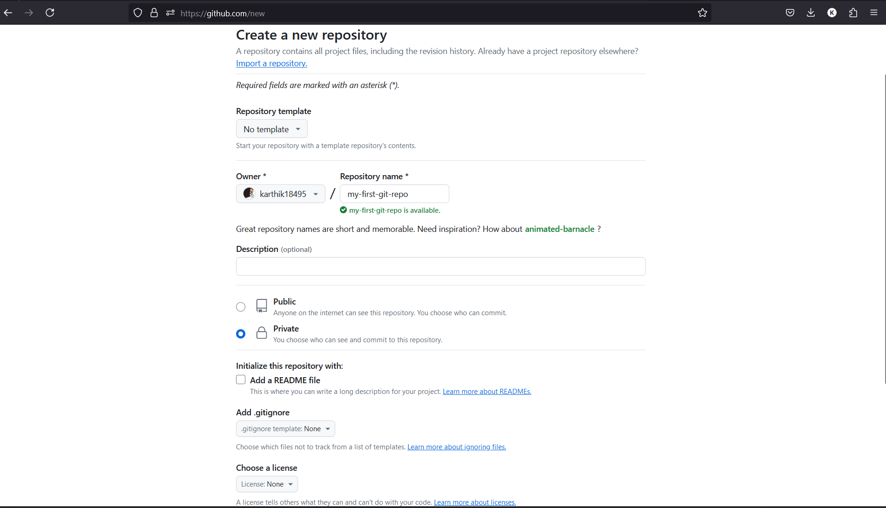

# Exercise 1: Basic Git Commands

In this exercise, you will learn the basic Git commands. you will be creating your own private repository. 

(git:ex:create-repo)=
## Create a New Repository on GitHub
This is going to be our remote repository to which we will be uploading our projects.
* Go to GitHub and create a new repository named `my-first-git-project`.


* **Do not** initialize it with a README, .gitignore, or license. We will be creating a private repository so that we will be using the personal access tokens as well.



## Initialize a new local `git` repository

* In your terminal, let us create new directory 
```bash 
mkdir my-first-git-repo
```

* To align with GitHub naming scheme, the default branch is named as `main`. Hence, lets configure it. 
```bash
git config --global init.defaultBranch main
```

* Initialize a `git` repository. This should create a directory named `.git` within this folder.
```bash
git init
```

* This should initialize a empty repo with branch name `main`. 

```{admonition} Try this
:class: warning

* Check out the status of the `git` repo using `git status`
* Check out the commit log by using `git log`
```

## Add remote origin

As mentioned earlier, GitHub provides additional capabilities to git versioning system and allows to collaborate among various developers. Let us link the remote repo at GitHub that we have created in {ref}`step-1 <git:ex:create-repo>`. 
```bash
git remote add origin https://github.com/username/my-first-git-repo.git
```
This creates a remote repo named origin which points to `https://github.com/username/my-first-git-repo.git`

## Add contents to the local repo

* Let us add contents to the repo and stage it for a commit.
   ```bash
   echo "Hello, Git My Name is ${USER}!" > first_file.txt
   git add first_file.txt
   ```
you can also specific a directory to be included as well. Also, you can include all the files by specifying the option `git add -A`, to list down a complete usage of `add` try out `git add --help`

* Let us commit this file to be pushed into the repo. This commit will now update the records in git that there has been a commit (or change) that had happended. This is like recording the history. The -m flag allows you to add a commit message directly from the command line. Commit messages should be concise yet descriptive.

```bash
git commit -m "My first commit message. Commit message has to short and meaningful"
``` 

If you have not authenticated before it will ask you to authenticate yourself with username and email. Try out the steps we did during configuring `git`. Note that this is because, the `.git` will record this as to who had made this commit. 

* Now push the commit to the remote repository to sync the remote and local repo.
```bash
git push -u origin main
```
This may once again prompt for authentication of your GitHub credentials. The command pushes the commit to origin in the branch main. Note, that if the branch name is not in the remote repository, then, it will create the branch in the remote repository as well.

You can post a screenshot or your push action below in the comment section.

```{raw} html
<script
   type="text/javascript"
   src="https://utteranc.es/client.js"
   async="async"
   repo="aid2e/boot-camp-2024"
   issue-term="pathname"
   theme="github-dark"
   label="💬 git-ex-1"
   crossorigin="anonymous"
/>
```